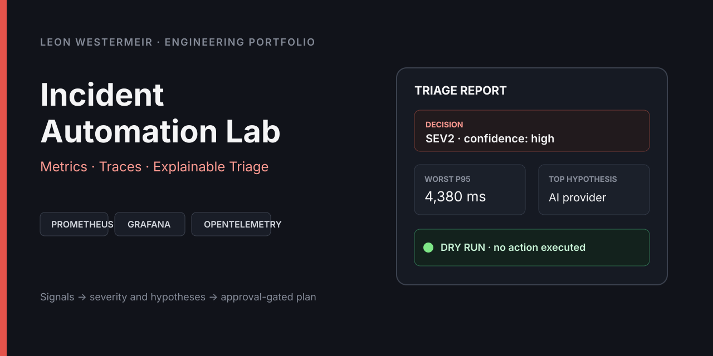
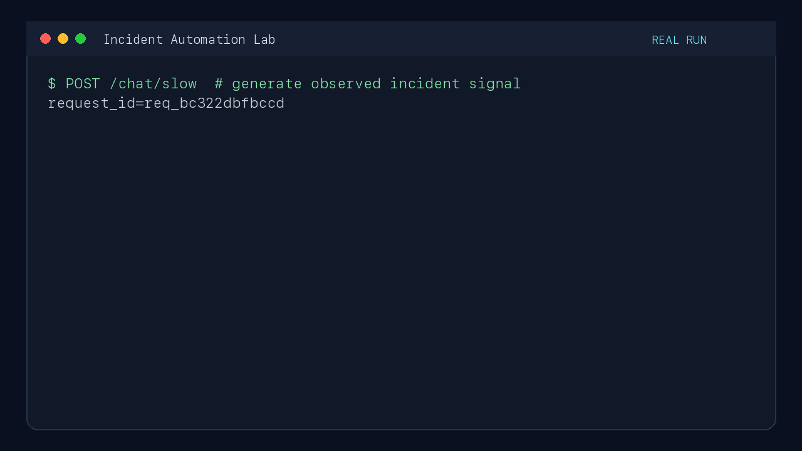

# Incident Automation Lab

[](https://github.com/leonwwest/slow-ai-app-incident-lab/actions/workflows/ci.yml)
[](https://github.com/leonwwest/slow-ai-app-incident-lab/actions/workflows/security.yml)
[](LICENSE)
[](https://www.python.org/)
[](docker-compose.yml)



A reproducible incident-response lab that correlates metrics, structured logs
and OpenTelemetry traces, then turns the evidence into an explainable, safe
triage decision. It is built around a deliberately degraded FastAPI service,
not a production outage or a live AI provider.

## 60-second view

| | Evidence |
|---|---|
| **Incident** | Simulated latency, provider failures, API-key errors, slow database calls and cost signals |
| **Telemetry** | Prometheus metrics, JSON logs in Loki and OTLP traces in Jaeger |
| **Decision support** | Deterministic SEV1-SEV4 classification, confidence and ranked hypotheses |
| **Operator safety** | Restart, scale, rollback and credential rotation are approval-only; no state-changing action is executed |
| **Operational proof** | Reproducible fixture, live HTTP demo, triage policy, worked incident, runbooks and postmortem template |
| **Delivery proof** | Unit tests, endpoint smoke tests, CodeQL, dependency audit, Trivy and an SPDX SBOM in GitHub Actions |

The checked-in degraded fixture produces a **SEV2 / high-confidence** decision:
240 requests, 8.75% errors and a 4,380 ms worst P95 on `/chat/slow`. The first
hypothesis points to the simulated AI-provider path; `executed_actions` remains
empty.

```bash
python -m scripts.triage examples/degraded-stats.json
```

That result is deterministic and covered by
[`tests/test_incident_triage.py`](tests/test_incident_triage.py). The thresholds
are published in the [automation policy](docs/AUTOMATION_POLICY.md).

## Evidence map

| Capability | Where to inspect it |
|---|---|
| Metrics and alerting | [`app/metrics.py`](app/metrics.py), [`prometheus/alerts.yml`](prometheus/alerts.yml), [`grafana/dashboards/incident-dashboard.json`](grafana/dashboards/incident-dashboard.json) |
| Structured request logs | [`app/middleware.py`](app/middleware.py), [`app/logging_setup.py`](app/logging_setup.py), [`loki/loki-config.yml`](loki/loki-config.yml) |
| Distributed traces | [`app/tracing.py`](app/tracing.py), provider and database-exercise spans in [`app/ai_provider.py`](app/ai_provider.py) and [`app/routers/diagnostics.py`](app/routers/diagnostics.py) |
| Explainable triage | [`app/incident_triage.py`](app/incident_triage.py), [`app/routers/triage.py`](app/routers/triage.py), [`scripts/triage.py`](scripts/triage.py) |
| Incident procedure | [triage runbook](docs/TRIAGE_RUNBOOK.md), [full runbook](docs/RUNBOOK.md), [worked incident](docs/INCIDENT_EXAMPLE.md), [postmortem template](docs/POSTMORTEM_TEMPLATE.md) |
| Latency, error and cost analysis | [`scripts/analyze.py`](scripts/analyze.py), [`sql/observability_queries.sql`](sql/observability_queries.sql) |
| Verification and supply chain | [CI workflow](.github/workflows/ci.yml), [security workflow](.github/workflows/security.yml), [`requirements-dev.txt`](requirements-dev.txt) |

## Recorded exercise

This recording shows a request to the deliberately slow endpoint, live triage
and the test suite. Triage stays in `dry-run`: it recommends evidence and
operator decisions but never restarts, scales or rolls back a service.



## How the lab works

```text
client / k6
    |
    v
FastAPI service ----> SQLite or PostgreSQL request history
    |                         |
    |                         +--> percentile, error and cost analysis
    |
    +--> Prometheus metrics --> alerts + Grafana
    +--> structured logs ----> Loki + Grafana
    +--> OTLP spans ----------> Jaeger
    |
    +--> /api/stats ----------> deterministic triage --> operator decision
```

The full Docker Compose stack contains the app, PostgreSQL, Prometheus,
Alertmanager, Grafana, Loki, Promtail and Jaeger. The application also runs
locally with zero-setup SQLite.

### Signals captured per request

- request ID, endpoint, status code and total latency;
- provider and database latency;
- token use and estimated cost;
- deployment version and error message;
- Prometheus request, provider, database and cost metrics;
- OpenTelemetry request spans plus provider and database-exercise spans.

The triage engine uses the one-hour summary from `/api/stats`. It reports the
observed signals, sample-size-based confidence, severity and the next evidence
needed to validate each hypothesis. Sparse data is classified as
`insufficient-data` instead of triggering remediation.

## Run it

### Fast path: local SQLite

Requires Python 3.11+.

```bash
python -m venv .venv
source .venv/bin/activate
pip install -r requirements-dev.txt
python run.py
```

In another terminal:

```bash
curl -s http://localhost:8010/health
curl -s http://localhost:8010/api/stats | python -m json.tool
curl -s http://localhost:8010/api/triage | python -m json.tool
```

### Full observability stack

```bash
docker compose up --build
```

| Service | URL |
|---|---|
| API and OpenAPI | `http://localhost:8010` / `http://localhost:8010/docs` |
| Grafana | `http://localhost:3000` (`admin` / `admin`) |
| Prometheus | `http://localhost:9090` |
| Alertmanager | `http://localhost:9093` |
| Jaeger | `http://localhost:16686` |

Generate mixed traffic with the k6 scenarios, then analyse the stored request
history:

```bash
k6 run k6/load-test.js
python scripts/analyze.py --hours 1
```

## Verification

```bash
python -m pytest -q
python -m compileall app scripts
docker compose config --quiet
```

The pull-request workflows additionally start the service and smoke-test
`/health`, `/chat`, `/db-query`, `/metrics` and `/api/triage`. Security checks
run CodeQL, `pip-audit`, Trivy filesystem scanning and SPDX SBOM generation.

## Simulation and safety boundary

This repository is an engineering exercise. Provider delay, failures, tokens
and cost are generated by the local simulation; the example incident and its
numbers are not measurements from a production system. Loki, Jaeger and
Prometheus receive real telemetry from the running lab, while external cloud
services and remediation actions remain simulated.

The automation is deliberately decision support only:

- automatic: classify, rank hypotheses, collect evidence and draft an update;
- approval required: restart, scale, rollback and rotate credentials;
- never automatic: destructive or state-changing remediation.

See [`docs/AUTOMATION_POLICY.md`](docs/AUTOMATION_POLICY.md) for the exact
severity contract and [`docs/RUNBOOK.md`](docs/RUNBOOK.md) for the operator
decision tree.

## Deeper documentation

- [Automated triage runbook](docs/TRIAGE_RUNBOOK.md)
- [Full ten-step incident runbook](docs/RUNBOOK.md)
- [Worked simulated incident](docs/INCIDENT_EXAMPLE.md)
- [Automation policy and safety model](docs/AUTOMATION_POLICY.md)
- [Postmortem template](docs/POSTMORTEM_TEMPLATE.md)
- [PostgreSQL observability queries](sql/observability_queries.sql)

## License

[MIT](LICENSE)
